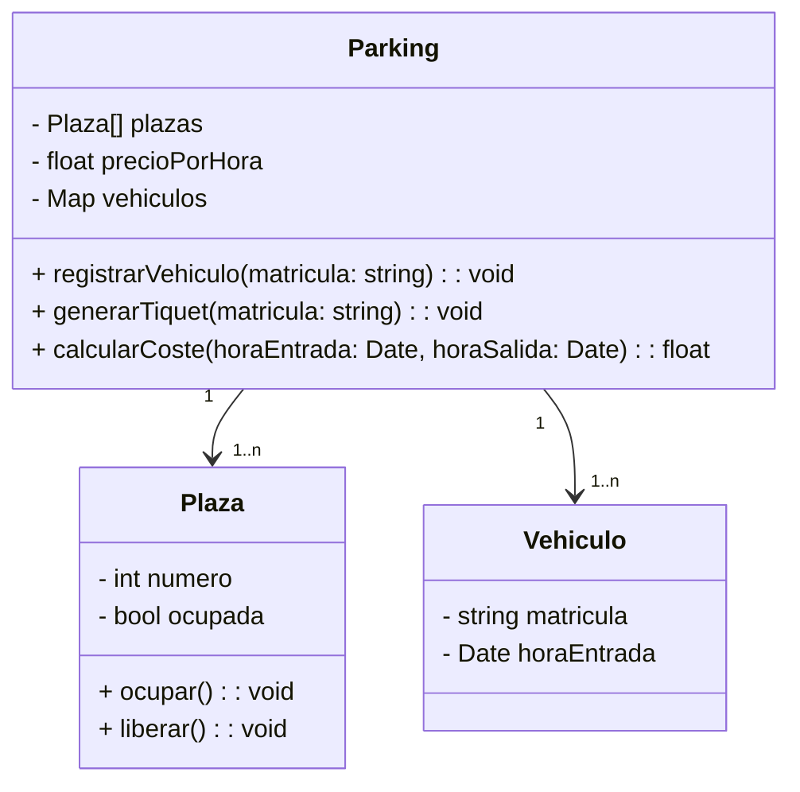

```mermaid
classDiagram
    class Plaza {
        - int numero
        - bool ocupada
        + ocupar(): void
        + liberar(): void
    }
    class Vehiculo {
        - string matricula
        - Date horaEntrada
    }
    class Parking {
        - Plaza[] plazas
        - float precioPorHora
        - Map<string, Vehiculo> vehiculos
        + registrarVehiculo(matricula: string): void
        + generarTiquet(matricula: string): void
        + calcularCoste(horaEntrada: Date, horaSalida: Date): float
    }

    Parking "1" --> "1..n" Plaza
    Parking "1" --> "1..n" Vehiculo
```
