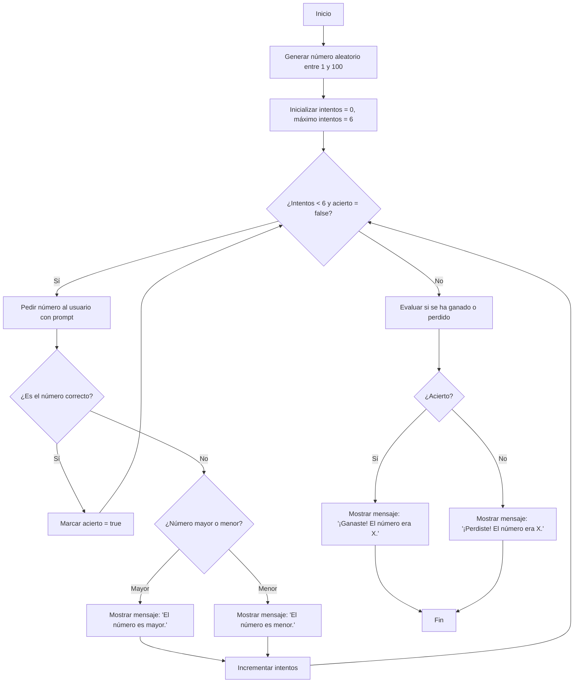

```mermaid
flowchart TD
    A[Inicio] --> B[Generar número aleatorio entre 1 y 100]
    B --> C[Inicializar intentos = 0, máximo intentos = 6]
    C --> D{¿Intentos < 6 y acierto = false?}

    D -->|No| E[Evaluar si se ha ganado o perdido]
    D -->|Sí| F[Pedir número al usuario con prompt]

    F --> G{¿Es el número correcto?}

    G -->|Sí| H[Marcar acierto = true]
    G -->|No| I{¿Número mayor o menor?}

    I -->|Mayor| J[Mostrar mensaje: 'El número es mayor.']
    I -->|Menor| K[Mostrar mensaje: 'El número es menor.']

    J --> L[Incrementar intentos]
    K --> L
    L --> D

    H --> D

    E --> M{¿Acierto?}

    M -->|Sí| N[Mostrar mensaje: '¡Ganaste! El número era X.']
    M -->|No| O[Mostrar mensaje: '¡Perdiste! El número era X.']

    N --> P[Fin]
    O --> P
```
